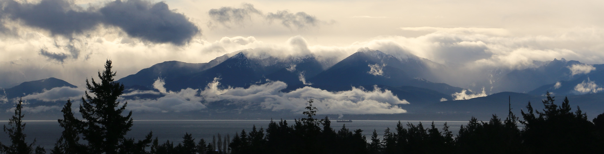

## Hello! I'm Jensen.

I'm an incoming planetary science PhD student in the [Department of Earth, Atmospheric and Planetary Sciences](https://eapsweb.mit.edu/) at MIT. I'll be joining [Prof. Richard Teague](https://richteague.github.io/)'s group, where my main research focus will be planet formation and evolution. Additionally, I'm interested in planetary climate systems, planetary habitability, and exoplanet detection and characterization. I also hope to use my time at EAPS to learn more about Earth's climate and how to combat the climate crisis.

Much of my research has a significant programming component, and I also pursue side projects for fun (coding is one of my favourite skills that I learned in undergrad). As well, I am a strong believer in making science more open source and accessible. As a result, I try to make a habit of properly documenting all my code and making is publicly available on GitHub. Feel free to browse my repos and check out my work!

#### Education
- Starting 2023 | PhD in Planetary Science, Massachusetts Institute of Technology
- 2018 - 2023 | BSc in Honours Mathematical Physics, University of Waterloo

#### Connect
- Email: [jptl@mit.edu](mailto:jptl@mit.edu)
- LinkedIn: [jensen-lawrence](https://linkedin.com/in/jensen-lawrence)
- ORCid: [0009-0007-5371-3548](https://orcid.org/0009-0007-5371-3548)

You can learn more about me on my [website](https://jensenlawrence.github.io).
